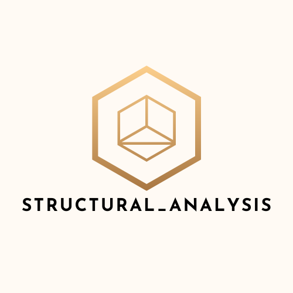

# structural_analysis
 Library to perfrom framed structures analysis

## Installation

Use the package manager [pip](https://pip.pypa.io/en/stable/) to install StructuralAnalysis.

```bash
pip install structural_analysis
```

## Requirements
The following packages must be installed first:

```bash
pip install numpy==1.22.4
pip install PyOpenGL==3.1.6
pip install PyQt5==5.15.6
pip install pyqtgraph==0.12.4
```
## Usage

```python
# Two_Story_Frame.py

from structural_analysis import Node, Structure, section, material, Solver, Visualizer
from structural_analysis.frame_elements import *

# General considerations:
#    - y-axis is upward
#    - use consistent units
#    - each node has 6 degrees of freedom dx: dof_1, dy: dof_2, dz: dof_3, rx: dof_4, ry: dof_5, rz: dof_6

# create node objects <Node(x, y, z)>
n1 = Node(0, 0, 0)
n2 = Node(6000, 0, 0)
n3 = Node(0, 0, 6000)
n4 = Node(6000, 0, 6000)

n5 = Node(0, 6000, 0)
n6 = Node(6000, 6000, 0)
n7 = Node(0, 6000, 6000)
n8 = Node(6000, 6000, 6000)

n9 = Node(0, 12000, 0)
n10 = Node(6000, 12000, 0)
n11 = Node(0, 12000, 6000)
n12 = Node(6000, 12000, 6000)

# create section object
user_defined_section = section.ArbitrarySection(area=3000, inertia_y=180 * 10 ** 6, inertia_z=180 * 10 ** 6,
                                                polar_inertia=360 * 10 ** 6, warping_rigidity=0)

rectangular_section = section.Rectangle(breadth=150, depth=300)

# create material object
steel = material.Steel(yield_strength=250, ultimate_strength=400, elasticity_modulus=200000, poissons_ratio=0.2)

# create frame element objects <FrameElement(start_node: Node, end_node: Node, section: Section, material: Material)>
e15 = FrameElement(n1, n5, user_defined_section, steel)
e26 = FrameElement(n2, n6, user_defined_section, steel)
e37 = FrameElement(n3, n7, rectangular_section, steel)
e48 = FrameElement(n4, n8, rectangular_section, steel)

e56 = FrameElement(n5, n6, user_defined_section, steel)
e68 = FrameElement(n6, n8, user_defined_section, steel)
e87 = FrameElement(n8, n7, rectangular_section, steel)
e57 = FrameElement(n5, n7, rectangular_section, steel)

e59 = FrameElement(n5, n9, user_defined_section, steel)
e610 = FrameElement(n10, n6, user_defined_section, steel)
e711 = FrameElement(n11, n7, rectangular_section, steel)
e812 = FrameElement(n8, n12, rectangular_section, steel)

e910 = FrameElement(n9, n10, rectangular_section, steel)
e1112 = FrameElement(n11, n12, rectangular_section, steel)
e911 = FrameElement(n11, n9, user_defined_section, steel)
e1012 = FrameElement(n10, n12, user_defined_section, steel)

# create truss element object
e16 = TrussElement(n1, n6, rectangular_section, steel)

# assign boundary conditions; node_1 is hinged, node_2, 3, 4 are fixed
n1.dof_x.restrained = True
n1.dof_y.restrained = True
n1.dof_z.restrained = True

n2.dof_x.restrained = True
n2.dof_y.restrained = True
n2.dof_z.restrained = True
n2.dof_rx.restrained = True
n2.dof_ry.restrained = True
n2.dof_rz.restrained = True

n3.dof_x.restrained = True
n3.dof_y.restrained = True
n3.dof_z.restrained = True
n3.dof_rx.restrained = True
n3.dof_ry.restrained = True
n3.dof_rz.restrained = True

n4.dof_x.restrained = True
n4.dof_y.restrained = True
n4.dof_z.restrained = True
n4.dof_rx.restrained = True
n4.dof_ry.restrained = True
n4.dof_rz.restrained = True

# assign loads to node_10 in the x-direction, and to node_6 in the z-direction
n10.dof_x.assign_force(2000000)
n6.dof_z.assign_force(4000000)

# assign initial displacement to node_4 in the negative y-direction
n4.dof_y.assign_initial_displacement = -1000

# create structure object
structure = Structure([e15, e26, e37, e48, e56, e68, e87, e57, e59, e610, e711, e812, e910, e1112, e911, e1012, e16])

# run first_order_elastic analysis
solver = Solver(structure)
solver.run()

visualizer = Visualizer(structure)
# show undeformed structure
visualizer.show_structure()

# show deformations <show_deformed_shape(structure, number_of_stations, scale)>
visualizer.show_deformed_shape(1)

# show window
visualizer.execute_qt()


```
## Output
Upon running the above code, two text files ("Input.exe" and "Results.exe") are generated in the working directory.
The "Results.txt" contains the displacements and reactions solved for. The following window pops up showing the undeformed structure 
(white) and the deformed shape (red).
The axis colors are as follows:
- Blue : X-axis
- Yellow: Y-axis
- Green: Z-axis
 


## Gallery
Python files for below pictures can be found in the "Examples" folder.
* Examples/ Hinged_Fixed_2D_Frame.py

* Examples/ Pyramid_Frame.py

* Examples/ Two_Story_Frame.py

* Examples/ Frame_Truss.py


## Under Development
The following enhancements will be included soon:
 * Releases at element end nodes.
 * Non-nodal loading.
 * Straining actions diagrams
 * Initial thermal straining.
 * Second-order elastic analysis.
 * First-order inelastic analysis.
 * Second-order inelastic analysis.
 * Eigenvalue analysis of buckling.
 * Dynamic analysis
 
## Considerations
Kindly note that the library is still under development, errors may arise as
the library is still under testing. The visualization depends on graphics library 
[PyQtGraph](https://github.com/pyqtgraph/pyqtgraph) which is still in its early stages of development, as a result, some of the features of displaying texts
(i.e., node labels, axis labels, ..) have not been included yet.
